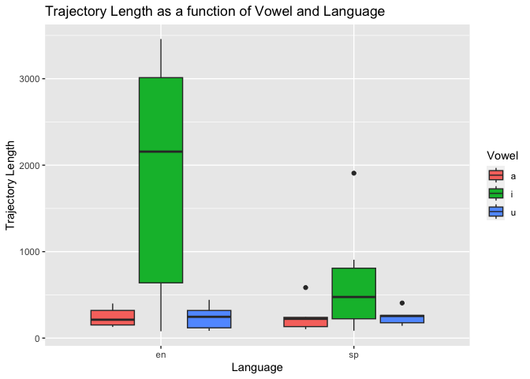
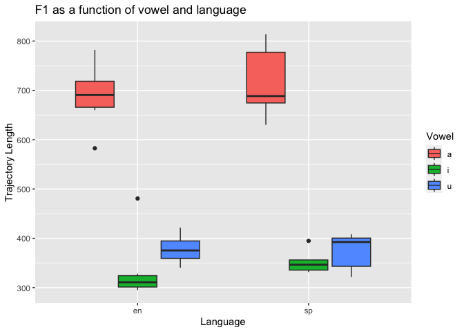
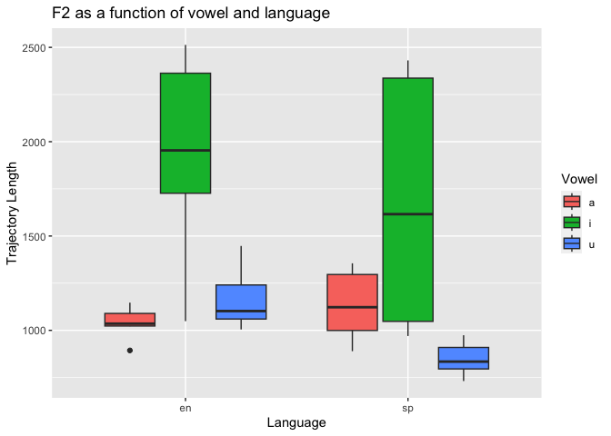

# Programming assigment 3
2024-04-01

## Answers to questions:

a\. This section is calculating the formants in different parts of the
vowel segment. The percentages increment from the start point of the
segment to calculate F1 and F2 showing values for the specific portion
according to each percentage.

b\. The first part tells praat where to where to find the files to
analyze and where to save the data. It creates a file where all the
information extracted needs to go. In the second part, the script, it
gets the the name from tier 1 to put on the csv table. Then, it goes to
tier 2 to measures the F1 and F2 trajectories with the different
percentages, and from tier 3, it gets the name of the language to put
into the csv. Lastly, the Looping process happens with each sound file
and the information is transferred into the data file.

c\. In the past, we used tier 3 to mark the midpoint to calculate
formant values of the vowel. Now, we used tier 2 instead, which might be
more advantageous because with this script we can calculate different
portions of the formants. I think it is more specific than using the
midpoint in the previous assignment because we relied on visual
perception, and now the the different values allow to obtain an average
we might be more accurate.

``` r
library(tidyverse)
```

    ── Attaching core tidyverse packages ──────────────────────── tidyverse 2.0.0 ──
    ✔ dplyr     1.1.4     ✔ readr     2.1.5
    ✔ forcats   1.0.0     ✔ stringr   1.5.1
    ✔ ggplot2   3.4.4     ✔ tibble    3.2.1
    ✔ lubridate 1.9.3     ✔ tidyr     1.3.1
    ✔ purrr     1.0.2     
    ── Conflicts ────────────────────────────────────────── tidyverse_conflicts() ──
    ✖ dplyr::filter() masks stats::filter()
    ✖ dplyr::lag()    masks stats::lag()
    ℹ Use the conflicted package (<http://conflicted.r-lib.org/>) to force all conflicts to become errors

``` r
data <- read.csv("/Users/jorgevargasmutizabal/Desktop/pa_3/data/vowel_data.csv")
glimpse (data)
```

    Rows: 36
    Columns: 17
    $ id       <chr> "jv", "jv", "jv", "jv", "jv", "jv", "jv", "jv", "jv", "jv", "…
    $ item     <chr> "   meet", "beat", "feet", "seat", "heat", "fleet", "moss", "…
    $ vowel    <chr> "i", "i", "i", "i", "i", "i", "a", "a", "a", "a", "a", "a", "…
    $ language <chr> "en", "en", "en", "en", "en", "en", "en", "en", "en", "en", "…
    $ f1_cent  <dbl> 480.71, 328.10, 312.79, 294.86, 309.04, 298.59, 782.26, 697.7…
    $ f2_cent  <dbl> 2474.55, 1675.81, 1879.50, 1048.72, 2028.20, 2513.10, 1104.72…
    $ tl       <dbl> 79.37, 2050.38, 3458.89, 2262.70, 3262.02, 168.73, 163.77, 12…
    $ f1_20    <dbl> 489.23, 337.42, 353.26, 334.90, 303.31, 288.91, 802.53, 669.2…
    $ f1_35    <dbl> 490.71, 340.77, 319.04, 316.75, 307.81, 299.98, 795.34, 723.3…
    $ f1_50    <dbl> 495.63, 349.42, 306.56, 280.02, 299.31, 301.34, 811.27, 698.3…
    $ f1_65    <dbl> 481.77, 316.98, 291.72, 273.80, 310.17, 301.72, 769.77, 705.9…
    $ f1_80    <dbl> 446.23, 295.89, 293.37, 268.84, 324.61, 300.98, 732.39, 691.8…
    $ f2_20    <dbl> 2462.08, 2430.55, 2213.48, 2471.49, 2393.02, 2467.64, 1111.87…
    $ f2_35    <dbl> 2476.96, 2443.60, 2283.14, 555.61, 2384.22, 2526.42, 1144.15,…
    $ f2_50    <dbl> 2483.79, 2459.53, 2304.06, 791.89, 752.50, 2552.67, 1121.69, …
    $ f2_65    <dbl> 2486.11, 602.95, 514.68, 739.73, 2327.24, 2548.70, 1070.92, 1…
    $ f2_80    <dbl> 2463.82, 442.42, 2082.15, 684.87, 2284.00, 2470.05, 1074.96, …

``` r
data %>%
  group_by(id) %>%
  summarize(avg_f1_cent = mean(f1_cent), 
            sd_f1_cent = sd(f1_cent), 
            avg_f2_cent = mean(f2_cent),
            sd_f2_cent = sd(f2_cent),
            avg_tl = mean(tl),
            sd_tl = sd(tl))
```

    # A tibble: 1 × 7
      id    avg_f1_cent sd_f1_cent avg_f2_cent sd_f2_cent avg_tl sd_tl
      <chr>       <dbl>      <dbl>       <dbl>      <dbl>  <dbl> <dbl>
    1 jv           474.       172.       1300.       524.   587.  867.

``` r
data %>%
  ggplot(
    aes(x = language, y = tl, fill = vowel)) +
  geom_boxplot() +
  labs(x = "Language", y = "Trajectory Length", fill = "Vowel") +
ggtitle("Trajectory Length as a function of Vowel and Language")
```



``` r
data %>%
  ggplot(
    aes(x = language, y = f1_cent, fill = vowel)) +
  geom_boxplot() +
  labs(x = "Language", y = "Trajectory Length", fill = "Vowel") +
ggtitle("F1 as a function of vowel and language")
```



``` r
data %>%
  ggplot(
    aes(x = language, y = f2_cent, fill = vowel)) +
  geom_boxplot() +
  labs(x = "Language", y = "Trajectory Length", fill = "Vowel") +
ggtitle("F2 as a function of vowel and language")
```


